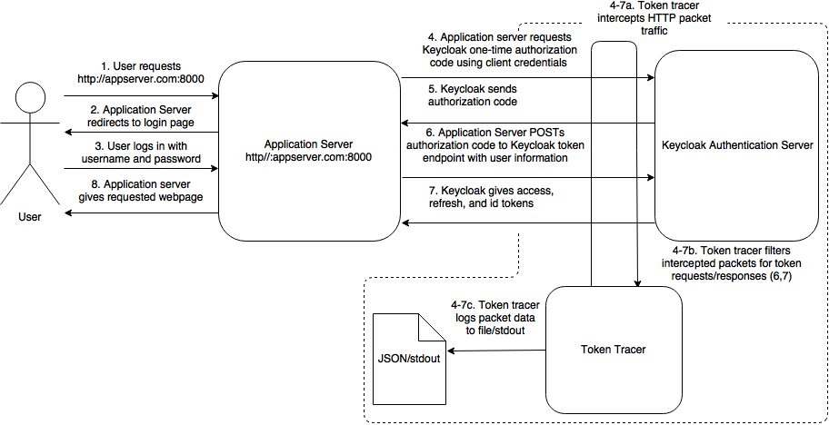
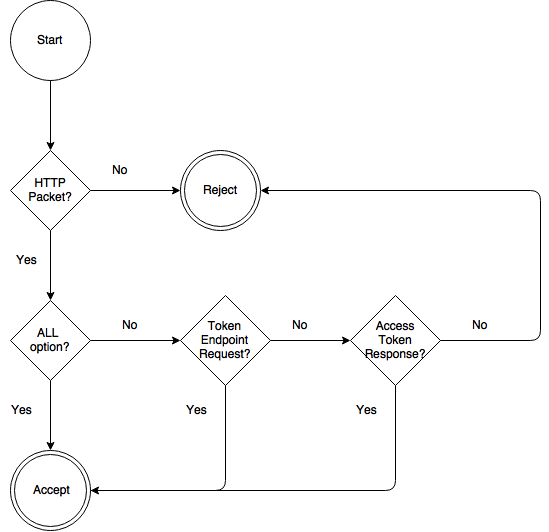
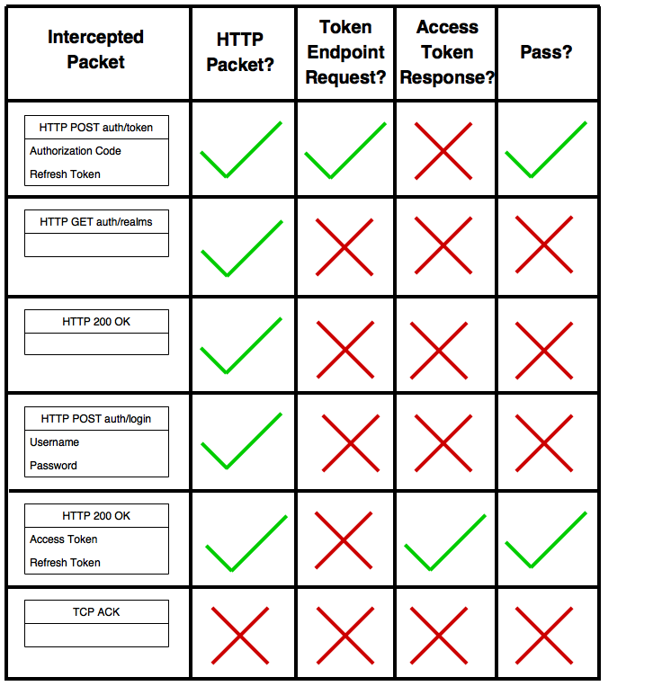
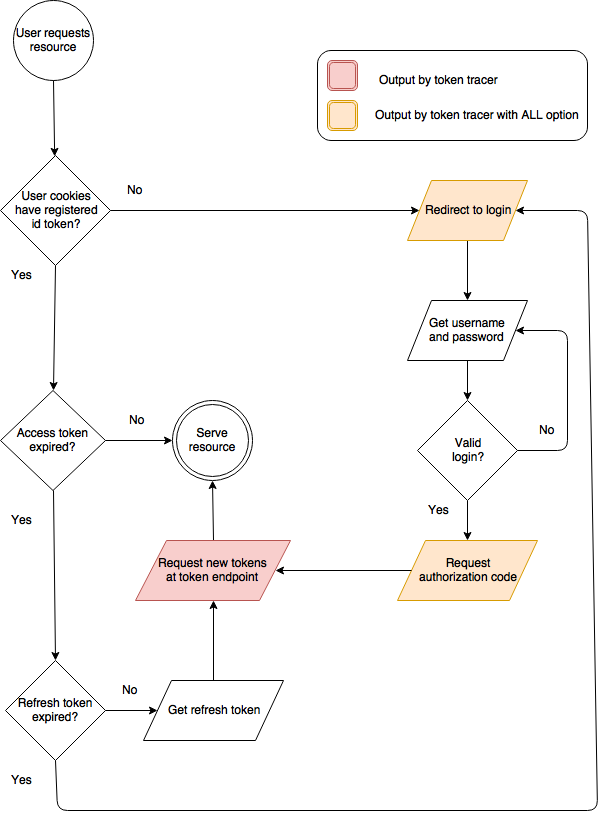

================================
Keycloak Token Tracer Program
================================

1.1 Overview
-----------------------

- Python command line program deployable on Keycloak authentication servers

- Listens through the ethernet interface of the Keycloak software containers for container deployment

- Uses pyshark library frontend for tshark for packet sniffing capabilites

- Continuously searches for HTTP requests to the token endpoint of the Keycloak server and the resulting Keycloak server response

- Extracts the Access Token, Refresh Token, and Id Token provided from these requests and prints header and payload data to stdout

- Captures both first-time authentication requests using a one-time access code provided by Keycloak after login and refresh token requests 

- Refresh token requests are used when the access token has expired to retrieve a new set of tokens

- Authorization code requests are used when the user has no valid tokens and must authenticate via a username and password to retrieve a set of tokens

- The program may output a json-formatted file containing the information extracted from each request and response

- The program also tracks:

 - Expiry times of access and refresh tokens
 - Source and destination IP and port numbers
 - Client secret 
 - Client Id

- Command line arguments are planned to be added

1.2 Examples:
------------------------

Example 1 - Refresh Token Request:
====================================

A user attempts to access the GA4GH server with an expired access token and unexpired refresh token. A request is made to the token endpoint of the Keycloak server to retrieve a new set of tokens using the unexpired refresh token.

::

    ./tokenTracer.py

    HTTP Protocol:        POST /auth/realms/CanDIG/protocol/openid-connect/token HTTP/1.1\r\n
    Packet Size:          1481
    Source:               172.17.0.1:56648
    Destination:          172.17.0.2:8080
    Client Secret:        250e42b8-3f41-4d0f-9b6b-e32e09fccaf7
    Client Id:            ga4ghServer
    Grant Type:           refresh_token
    Refresh Token:        eyJhbGciOiJSUzI1NiIsInR5cCIgOiAiSldUIiwia2lkIiA6ICJoWldPSWExUWJXczN
    WZjVDX2NpWTRsU1U0ZjRacHZWLXdKRHZHVkMtWXNnIn0.eyJqdGkiOiI3NDY0YTdjOC01NzQzLTRlNDYtOTEyMC01
    MzVkMTU5ZGQ3MjAiLCJleHAiOjE1MDg3NzU0NjQsIm5iZiI6MCwiaWF0IjoxNTA4NzczNjY0LCJpc3MiOiJodHRwO
    i8vMTkyLjE2OC45OS4xMDA6ODA4MC9hdXRoL3JlYWxtcy9DYW5ESUciLCJhdWQiOiJnYTRnaFNlcnZlciIsInN1Yi
    I6IjhhMzViYWI0LWMxZTktNDUzNi1iOWEwLTViZjI5MDA0Y2RlYyIsInR5cCI6IlJlZnJlc2giLCJhenAiOiJnYTR
    naFNlcnZlciIsImF1dGhfdGltZSI6MCwic2Vzc2lvbl9zdGF0ZSI6IjFkMDA5NWE3LTg0MDEtNDYwYi1hMjAxLTEz
    MGM5MjdlODM0YiIsInJlYWxtX2FjY2VzcyI6eyJyb2xlcyI6WyJ1bWFfYXV0aG9yaXphdGlvbiJdfSwicmVzb3VyY
    2VfYWNjZXNzIjp7ImFjY291bnQiOnsicm9sZXMiOlsibWFuYWdlLWFjY291bnQiLCJtYW5hZ2UtYWNjb3VudC1saW
    5rcyIsInZpZXctcHJvZmlsZSJdfX19.Qeba3s9E_zjROppZxT5FL2Je0iQ7W4wpIPKW7I_TyImzdyxkHWxLjYxQFo
    Sr1xA5rRa7QWVRwDfjli5xrFq5U1NLlvOBWkAaVrIMsiOAh8a5URLR1WnfTtcQF6-qyez64f-Sx5JY4U8oLhf0UsZ
    AOo8yMMWYozkuB_7Lfv_D6GzGZatKqk-oWbWPdvjX5k-J-7x2T8dkwn7d07ZfAO8OghaxhD_zN0rEQuruwBx5Wl6v
    JpF5DqNvDX7TYUBturJb5-jKhN8juiP_HFCr6QET9k3DSLtxyD_wpmDOPp4_OY3-R6gYtFFRfzzdnBp8dm6Azj_q5
    oVldR_wX7Tncb3xAw

    HTTP Protocol:        HTTP/1.1 200 OK\r\n
    Packet Size:          3582
    Source:               172.17.0.2:8080
    Destination:          172.17.0.1:56648
    Access Token:         eyJhbGciOiJSUzI1NiIsInR5cCIgOiAiSldUIiwia2lkIiA6ICJoWldPSWExUWJXczN
    WZjVDX2NpWTRsU1U0ZjRacHZWLXdKRHZHVkMtWXNnIn0.eyJqdGkiOiJiNjBhMDZmMS1mMWNhLTRiNzctODhjZi1m
    YTAyYWRmZGVkNGUiLCJleHAiOjE1MDg3NzQwMjQsIm5iZiI6MCwiaWF0IjoxNTA4NzczOTY0LCJpc3MiOiJodHRwO
    i8vMTkyLjE2OC45OS4xMDA6ODA4MC9hdXRoL3JlYWxtcy9DYW5ESUciLCJhdWQiOiJnYTRnaFNlcnZlciIsInN1Yi
    I6IjhhMzViYWI0LWMxZTktNDUzNi1iOWEwLTViZjI5MDA0Y2RlYyIsInR5cCI6IkJlYXJlciIsImF6cCI6ImdhNGd
    oU2VydmVyIiwiYXV0aF90aW1lIjoxNTA4NzczNjY0LCJzZXNzaW9uX3N0YXRlIjoiMWQwMDk1YTctODQwMS00NjBi
    LWEyMDEtMTMwYzkyN2U4MzRiIiwiYWNyIjoiMSIsImFsbG93ZWQtb3JpZ2lucyI6W10sInJlYWxtX2FjY2VzcyI6e
    yJyb2xlcyI6WyJ1bWFfYXV0aG9yaXphdGlvbiJdfSwicmVzb3VyY2VfYWNjZXNzIjp7ImFjY291bnQiOnsicm9sZX
    MiOlsibWFuYWdlLWFjY291bnQiLCJtYW5hZ2UtYWNjb3VudC1saW5rcyIsInZpZXctcHJvZmlsZSJdfX0sInByZWZ
    lcnJlZF91c2VybmFtZSI6InVzZXIifQ.mMRQQsur1W9Nef-67gZKc71lB3laRuLb16uC7S-E7OqcypJs9cDwFLx1L
    Vub_qL6WiyqczF9HMEhktq1rDaUWlwM-nXdPOjAQRB_C2pGDxX4Jl7iLoVf7x3OJKqoW6BWyDatXftl6oDg9k3TO0
    kjNot-2BD_VeW8703WXxF8tT4ZqeF3lwTlbrIF2Y1GDquS4O7pgoaugNJGcxIvH1GrJS_gJKcTlAut_9qkBw0V7IB
    dJagClp7jA1tq_NTcPqc4Dj8xwTVWKsQ_KShUZVtnE5ObAM8uHJ3I1mOriOvI6QsJY8__iM9Cn0Eh0PzT4aJfbWWt
    ekUnHX0916g5rV_N9Q
    Access Token Expiry:  60
    Refresh Token:        eyJhbGciOiJSUzI1NiIsInR5cCIgOiAiSldUIiwia2lkIiA6ICJoWldPSWExUWJXczN
    WZjVDX2NpWTRsU1U0ZjRacHZWLXdKRHZHVkMtWXNnIn0.eyJqdGkiOiJlYTUyMWI3My0xODA2LTRmYjUtOWUzYS1j
    ZDA2OTdhZDQxMmQiLCJleHAiOjE1MDg3NzU3NjQsIm5iZiI6MCwiaWF0IjoxNTA4NzczOTY0LCJpc3MiOiJodHRwO
    i8vMTkyLjE2OC45OS4xMDA6ODA4MC9hdXRoL3JlYWxtcy9DYW5ESUciLCJhdWQiOiJnYTRnaFNlcnZlciIsInN1Yi
    I6IjhhMzViYWI0LWMxZTktNDUzNi1iOWEwLTViZjI5MDA0Y2RlYyIsInR5cCI6IlJlZnJlc2giLCJhenAiOiJnYTR
    naFNlcnZlciIsImF1dGhfdGltZSI6MCwic2Vzc2lvbl9zdGF0ZSI6IjFkMDA5NWE3LTg0MDEtNDYwYi1hMjAxLTEz
    MGM5MjdlODM0YiIsInJlYWxtX2FjY2VzcyI6eyJyb2xlcyI6WyJ1bWFfYXV0aG9yaXphdGlvbiJdfSwicmVzb3VyY
    2VfYWNjZXNzIjp7ImFjY291bnQiOnsicm9sZXMiOlsibWFuYWdlLWFjY291bnQiLCJtYW5hZ2UtYWNjb3VudC1saW
    5rcyIsInZpZXctcHJvZmlsZSJdfX19.KGtnJab-3T31DX-QlifvSBARVVsNjZ6nyFMBpOd4soiXx-CV93zQa8eXKO
    fwHoHED4jFctilefROVfWU2kVlw_NpAhHsj0LTpLgTHPWUEa7GGc6V3iU1_yQaJwE7YMiDegcGp7L1aA7gISb8AGy
    3CvAwyveTPZiUZq4OOf47xtA6E_tw1Q_lKtu5QOmiAf8Lpbifk1R2ZhY5YuYOPTPQG4QfBA9P5yoIQ_-DptrKhj8e
    mq_0nMrRupvXkHr3ySI0dF3y0wIObfK6z0uh26qdrDwuLURscaTnmSdoqycd1XiUUm4z2SI86sIqBsE2rUoIkK113
    oNoTdcvMmC-SZCjfQ
    Refresh Token Expiry: 1800
    Token Type:           bearer
    Id Token:             eyJhbGciOiJSUzI1NiIsInR5cCIgOiAiSldUIiwia2lkIiA6ICJoWldPSWExUWJXczN
    WZjVDX2NpWTRsU1U0ZjRacHZWLXdKRHZHVkMtWXNnIn0.eyJqdGkiOiJjNDcwMTlmZS0zZjNiLTQ0Y2QtYjczYy0w
    OWI3MjMyNzM2YWQiLCJleHAiOjE1MDg3NzQwMjQsIm5iZiI6MCwiaWF0IjoxNTA4NzczOTY0LCJpc3MiOiJodHRwO
    i8vMTkyLjE2OC45OS4xMDA6ODA4MC9hdXRoL3JlYWxtcy9DYW5ESUciLCJhdWQiOiJnYTRnaFNlcnZlciIsInN1Yi
    I6IjhhMzViYWI0LWMxZTktNDUzNi1iOWEwLTViZjI5MDA0Y2RlYyIsInR5cCI6IklEIiwiYXpwIjoiZ2E0Z2hTZXJ
    2ZXIiLCJhdXRoX3RpbWUiOjE1MDg3NzM2NjQsInNlc3Npb25fc3RhdGUiOiIxZDAwOTVhNy04NDAxLTQ2MGItYTIw
    MS0xMzBjOTI3ZTgzNGIiLCJhY3IiOiIxIiwicHJlZmVycmVkX3VzZXJuYW1lIjoidXNlciJ9.XtXEoUBvHZ5zrJqW
    DzbiyHMMA1ERvK3pw77AXnGUKy-m4yv7j_Qm0dTMEd-kovVPhvkSDDHIu-35QUl_8fdQpQHldQ97bKJDjAaZjAN8Y
    yzObIYh0SMrJw-jAT8S_m-COzqpWb38H1iGlwa3jgdBz08maOI6KNepSVIbqfp2-sdxsHc1zgMCVnhBlcEcO144ee
    rR0Hn20vTTrHaNy7bBSZncxGYhWxeFPT15yI34I7XHYe2_zHfas8KmBfZVkAuNhPK84CFC-Ixm0hnJDLK5hhh71_O
    fg3ayitd2DlNqrX2vwbC59SBgy_4Q7P5dYzNFz4cBgHIUnMYfLlaHXX5EGg

See also example1.png for the corresponding screen capture of the command line.

Example 2 - Access Code Login 
===============================

A user attempts to access the GA4GH server with no tokens or all expired tokens. A request is made for a set of tokens using a one-time access code provided after authenticating through the redirected Keycloak login page.

::

    ./tokenTracer.py

    HTTP Protocol:        POST /auth/realms/CanDIG/protocol/openid-connect/token HTTP/1.1\r\n
    Packet Size:          617
    Source:               172.17.0.1:56644
    Destination:          172.17.0.2:8080
    Client Secret:        250e42b8-3f41-4d0f-9b6b-e32e09fccaf7
    Client Id:            ga4ghServer
    Grant Type:           authorization_code
    Authorization Code:   uss.aanh_9Uqg0xWV6WLBioNx3Pq3h5nocT_gbWVInxuU6s.9a3cbd3f-e689-452e-
    938a-9e9492018d97.0ef863dc-9f6d-4b7e-a706-4e460b4ba2e4
    Redirect Uri:         http://192.168.99.100:8000/oidc_callback
    Scope:                openid email

    HTTP Protocol:        HTTP/1.1 200 OK\r\n
    Packet Size:          3582
    Source:               172.17.0.2:8080
    Destination:          172.17.0.1:56644
    Access Token:         eyJhbGciOiJSUzI1NiIsInR5cCIgOiAiSldUIiwia2lkIiA6ICJoWldPSWExUWJXczN
    WZjVDX2NpWTRsU1U0ZjRacHZWLXdKRHZHVkMtWXNnIn0.eyJqdGkiOiJkNTgwNmZhNS03NWY4LTRiN2MtYmUwMC1l
    YzM3WQ3ZDI1YTkiLCJleHAiOjE1MDg3NzM5MTQsIm5iZiI6MCwiaWF0IjoxNTA4NzczODU0LCJpc3MiOiJodHRwOi
    8vMTkyLjE2OC45OS4xMDA6ODA4MC9hdXRoL3JlYWxtcy9DYW5ESUciLCJhdWQiOiJnYTRnaFNlcnZlciIsInN1YiI
    6IjhhMzViYWI0LWMxZTktNDUzNi1iOWEwLTViZjI5MDA0Y2RlYyIsInR5cCI6IkJlYXJlciIsImF6cCI6ImdhNGdo
    U2VydmVyIiwiYXV0aF90aW1lIjoxNTA4NzczODU0LCJzZXNzaW9uX3N0YXRlIjoiOWEzY2JkM2YtZTY4OS00NTJlL
    TkzOGEtOWU5NDkyMDE4ZDk3IiwiYWNyIjoiMSIsImFsbG93ZWQtb3JpZ2lucyI6W10sInJlYWxtX2FjY2VzcyI6ey
    Jyb2xlcyI6WyJ1bWFfYXV0aG9yaXphdGlvbiJdfSwicmVzb3VyY2VfYWNjZXNzIjp7ImFjY291bnQiOnsicm9sZXM
    iOlsibWFuYWdlLWFjY291bnQiLCJtYW5hZ2UtYWNjb3VudC1saW5rcyIsInZpZXctcHJvZmlsZSJdfX0sInByZWZl
    cnJlZF91c2VybmFtZSI6InVzZXIifQ.Rq9KM9Y7X4v4msbyqUHAGvWPWu_HdpWpYPwWsjfevvUKcMr_XWJu-pmdWR
    0EuJk0xN-df5Mr4hfmhxwsGYNmSHMrZfgWn6I4oiyy0fKJOtrCKYZHiFDwaAa9yCvEFIqgkoAyyKpMUpR4bLM5d6m
    68LiduHoFbIec24Oedyy9Hb5Hfvr4FboY7c5lc_VYwDfkfEgo_ws0do10n93_3DJuxgCUB8f_zjyybUaCmmQZcINC
    hFnXoyRKP2kMbuMOVryC4NyYAIZs0WKX3-9ZUe6zJiYTw0xq1JIn8ttz7b6AlckQtruM07t9qCmtjbzkg_olTGFJP
    4FFf7AzFRzpaSTtEQ
    Access Token Expiry:  60
    Refresh Token:        eyJhbGciOiJSUzI1NiIsInR5cCIgOiAiSldUIiwia2lkIiA6ICJoWldPSWExUWJXczN
    WZjVDX2NpWTRsU1U0ZjRacHZWLXdKRHZHVkMtWXNnIn0.eyJqdGkiOiIxZDBlMzMyZi1lOGQ3LTRhNjktOWQxZS03
    OWIzOGNmYjJlNjkiLCJleHAiOjE1MDg3NzU2NTQsIm5iZiI6MCwiaWF0IjoxNTA4NzczODU0LCJpc3MiOiJodHRwO
    i8vMTkyLjE2OC45OS4xMDA6ODA4MC9hdXRoL3JlYWxtcy9DYW5ESUciLCJhdWQiOiJnYTRnaFNlcnZlciIsInN1Yi
    I6IjhhMzViYWI0LWMxZTktNDUzNi1iOWEwLTViZjI5MDA0Y2RlYyIsInR5cCI6IlJlZnJlc2giLCJhenAiOiJnYTR
    naFNlcnZlciIsImF1dGhfdGltZSI6MCwic2Vzc2lvbl9zdGF0ZSI6IjlhM2NiZDNmLWU2ODktNDUyZS05MzhhLTll
    OTQ5MjAxOGQ5NyIsInJlYWxtX2FjY2VzcyI6eyJyb2xlcyI6WyJ1bWFfYXV0aG9yaXphdGlvbiJdfSwicmVzb3VyY
    2VfYWNjZXNzIjp7ImFjY291bnQiOnsicm9sZXMiOlsibWFuYWdlLWFjY291bnQiLCJtYW5hZ2UtYWNjb3VudC1saW
    5rcyIsInZpZXctcHJvZmlsZSJdfX19.Eta9y41VKyferszRdWMSGtcS2vLDDFQYICoTYCNH_sEz_KEKiUu4ieufkH
    kPN00l9MY6hUTcUjlwFX7u1Yrf9V1cRZI5mTIezhygDRrcmiIem19KzH9S5rUCcfnvInaIAsdSUWXzMxT46J4MJ1j
    AtvTX18-fZo0NWl2E7rurCY0wLE7BI7jLSh8TmACvOofmXkbOxlaly67bc8sVr7s5Avx6IrTGhgJ2p5qYTSXMdMFa
    ArlrdOrQr3-AjLi4snq4sGsOQuBxRI1oCbEaWz9bvvuGi7H2hC0xRFN3qMEga4X5twFUJXBb7paFX-38t6AYHwV_b
    3UvpQoyn51WdgFtYw
    Refresh Token Expiry: 1800
    Token Type:           bearer
    Id Token:             eyJhbGciOiJSUzI1NiIsInR5cCIgOiAiSldUIiwia2lkIiA6ICJoWldPSWExUWJXczN
    WZjVDX2NpWTRsU1U0ZjRacHZWLXdKRHZHVkMtWXNnIn0.eyJqdGkiOiIyMTNiZmI2NS1lOWU2LTRlYjUtOTA5OS1k
    ZGY3MjE2Y2JlNGEiLCJleHAiOjE1MDg3NzM5MTQsIm5iZiI6MCwiaWF0IjoxNTA4NzczODU0LCJpc3MiOiJodHRwO
    i8vMTkyLjE2OC45OS4xMDA6ODA4MC9hdXRoL3JlYWxtcy9DYW5ESUciLCJhdWQiOiJnYTRnaFNlcnZlciIsInN1Yi
    I6IjhhMzViYWI0LWMxZTktNDUzNi1iOWEwLTViZjI5MDA0Y2RlYyIsInR5cCI6IklEIiwiYXpwIjoiZ2E0Z2hTZXJ
    2ZXIiLCJhdXRoX3RpbWUiOjE1MDg3NzM4NTQsInNlc3Npb25fc3RhdGUiOiI5YTNjYmQzZi1lNjg5LTQ1MmUtOTM4
    YS05ZTk0OTIwMThkOTciLCJhY3IiOiIxIiwicHJlZmVycmVkX3VzZXJuYW1lIjoidXNlciJ9.Cp_hTXEU9JQUuGJP
    GX_BK3f6JsowPIhxbyhmMrHEU7eKmUDkFloPgkoZqASot5NA_ze01_poV-U52j48dGDZy2HEt20lAyMfPo20WkcPH
    DI1-8FxktyP2HDSpUKaXGBnqidR8TM8Q8OfKu2XKp02p5-Wv9biM1nEPaUZH_8NoggiILItQ-Kz8nm6JoiGKOjLOK
    kisjJhl22FZ3KyfZAKSHx0Q9YYPjoWxHqLHsZYFq46yzgi-OHlYmAld3KK5UwrjfTgtv1rcgh51i029Vh5_syFEjv
    G1DfusDBUbuC8D0NtDqi7ipkwpAINwIzP1hbqdOdGWO8IA16TXN4LCuvMbg

See also example2.png for t
he corresponding screen capture of the command line.

Example 3 - JSON Output File
===================================

The following JSON file contains the request/repsonse pairs of each of previous examples in their respective order. Each packet is formatted in its own JSON object on its own line. The data contained is identical to the data printed on stdout, but in a more easily parsed format.

::

    tokenPacket.json

    {"clientSecret": "250e42b8-3f41-4d0f-9b6b-e32e09fccaf7", "authorizationCode": "uss.aanh_9
    Uqg0xWV6WLBioNx3Pq3h5nocT_gbWVInxuU6s.9a3cbd3f-e689-452e-938a-9e9492018d97.0ef863dc-9f6d-
    4b7e-a706-4e460b4ba2e4", "packetSize": "617", "clientId": "ga4ghServer", "destIP": "172.1
    7.0.2", "sourceIP": "172.17.0.1", "rediectUri": "http://192.168.99.100:8000/oidc_callback
    ", "sourcePort": "56644", "scope": "openid email", "grantType": "authorization_code", "HT
    TP Header": "POST /auth/realms/CanDIG/protocol/openid-connect/token HTTP/1.1\\r\\n", "des
    tPort": "8080"}
    {"refreshToken": "eyJhbGciOiJSUzI1NiIsInR5cCIgOiAiSldUIiwia2lkIiA6ICJoWldPSWExUWJXczNWZjV
    DX2NpWTRsU1U0ZjRacHZWLXdKRHZHVkMtWXNnIn0.eyJqdGkiOiIxZDBlMzMyZi1lOGQ3LTRhNjktOWQxZS03OWIz
    OGNmYjJlNjkiLCJleHAiOjE1MDg3NzU2NTQsIm5iZiI6MCwiaWF0IjoxNTA4NzczODU0LCJpc3MiOiJodHRwOi8vM
    TkyLjE2OC45OS4xMDA6ODA4MC9hdXRoL3JlYWxtcy9DYW5ESUciLCJhdWQiOiJnYTRnaFNlcnZlciIsInN1YiI6Ij
    hhMzViYWI0LWMxZTktNDUzNi1iOWEwLTViZjI5MDA0Y2RlYyIsInR5cCI6IlJlZnJlc2giLCJhenAiOiJnYTRnaFN
    lcnZlciIsImF1dGhfdGltZSI6MCwic2Vzc2lvbl9zdGF0ZSI6IjlhM2NiZDNmLWU2ODktNDUyZS05MzhhLTllOTQ5
    MjAxOGQ5NyIsInJlYWxtX2FjY2VzcyI6eyJyb2xlcyI6WyJ1bWFfYXV0aG9yaXphdGlvbiJdfSwicmVzb3VyY2VfY
    WNjZXNzIjp7ImFjY291bnQiOnsicm9sZXMiOlsibWFuYWdlLWFjY291bnQiLCJtYW5hZ2UtYWNjb3VudC1saW5rcy
    IsInZpZXctcHJvZmlsZSJdfX19.Eta9y41VKyferszRdWMSGtcS2vLDDFQYICoTYCNH_sEz_KEKiUu4ieufkHkPN0
    0l9MY6hUTcUjlwFX7u1Yrf9V1cRZI5mTIezhygDRrcmiIem19KzH9S5rUCcfnvInaIAsdSUWXzMxT46J4MJ1jAtvT
    X18-fZo0NWl2E7rurCY0wLE7BI7jLSh8TmACvOofmXkbOxlaly67bc8sVr7s5Avx6IrTGhgJ2p5qYTSXMdMFaArlr
    dOrQr3-AjLi4snq4sGsOQuBxRI1oCbEaWz9bvvuGi7H2hC0xRFN3qMEga4X5twFUJXBb7paFX-38t6AYHwV_b3Uvp
    Qoyn51WdgFtYw", "tokenType": "bearer", "accessToken": "eyJhbGciOiJSUzI1NiIsInR5cCIgOiAiSl
    dUIiwia2lkIiA6ICJoWldPSWExUWJXczNWZjVDX2NpWTRsU1U0ZjRacHZWLXdKRHZHVkMtWXNnIn0.eyJqdGkiOiJ
    kNTgwNmZhNS03NWY4LTRiN2MtYmUwMC1lYzM3NWQ3ZDI1YTkiLCJleHAiOjE1MDg3NzM5MTQsIm5iZiI6MCwiaWF0
    IjoxNTA4NzczODU0LCJpc3MiOiJodHRwOi8vMTkyLjE2OC45OS4xMDA6ODA4MC9hdXRoL3JlYWxtcy9DYW5ESUciL
    CJhdWQiOiJnYTRnaFNlcnZlciIsInN1YiI6IjhhMzViYWI0LWMxZTktNDUzNi1iOWEwLTViZjI5MDA0Y2RlYyIsIn
    R5cCI6IkJlYXJlciIsImF6cCI6ImdhNGdoU2VydmVyIiwiYXV0aF90aW1lIjoxNTA4NzczODU0LCJzZXNzaW9uX3N
    0YXRlIjoiOWEzY2JkM2YtZTY4OS00NTJlLTkzOGEtOWU5NDkyMDE4ZDk3IiwiYWNyIjoiMSIsImFsbG93ZWQtb3Jp
    Z2lucyI6W10sInJlYWxtX2FjY2VzcyI6eyJyb2xlcyI6WyJ1bWFfYXV0aG9yaXphdGlvbiJdfSwicmVzb3VyY2VfY
    WNjZXNzIjp7ImFjY291bnQiOnsicm9sZXMiOlsibWFuYWdlLWFjY291bnQiLCJtYW5hZ2UtYWNjb3VudC1saW5rcy
    IsInZpZXctcHJvZmlsZSJdfX0sInByZWZlcnJlZF91c2VybmFtZSI6InVzZXIifQ.Rq9KM9Y7X4v4msbyqUHAGvWP
    Wu_HdpWpYPwWsjfevvUKcMr_XWJu-pmdWR0EuJk0xN-df5Mr4hfmhxwsGYNmSHMrZfgWn6I4oiyy0fKJOtrCKYZHi
    FDwaAa9yCvEFIqgkoAyyKpMUpR4bLM5d6m68LiduHoFbIec24Oedyy9Hb5Hfvr4FboY7c5lc_VYwDfkfEgo_ws0do
    10n93_3DJuxgCUB8f_zjyybUaCmmQZcINChFnXoyRKP2kMbuMOVryC4NyYAIZs0WKX3-9ZUe6zJiYTw0xq1JIn8tt
    z7b6AlckQtruM07t9qCmtjbzkg_olTGFJP4FFf7AzFRzpaSTtEQ", "packetSize": "3582", "accessTokenE
    xpiry": "60", "destIP": "172.17.0.1", "refreshTokenExpiry": "1800", "sourceIP": "172.17.0
    .2", "idToken": "eyJhbGciOiJSUzI1NiIsInR5cCIgOiAiSldUIiwia2lkIiA6ICJoWldPSWExUWJXczNWZjVD
    X2NpWTRsU1U0ZjRacHZWLXdKRHZHVkMtWXNnIn0.eyJqdGkiOiIyMTNiZmI2NS1lOWU2LTRlYjUtOTA5OS1kZGY3M
    jE2Y2JlNGEiLCJleHAiOjE1MDg3NzM5MTQsIm5iZiI6MCwiaWF0IjoxNTA4NzczODU0LCJpc3MiOiJodHRwOi8vMT
    kyLjE2OC45OS4xMDA6ODA4MC9hdXRoL3JlYWxtcy9DYW5ESUciLCJhdWQiOiJnYTRnaFNlcnZlciIsInN1YiI6Ijh
    hMzViYWI0LWMxZTktNDUzNi1iOWEwLTViZjI5MDA0Y2RlYyIsInR5cCI6IklEIiwiYXpwIjoiZ2E0Z2hTZXJ2ZXIi
    LCJhdXRoX3RpbWUiOjE1MDg3NzM4NTQsInNlc3Npb25fc3RhdGUiOiI5YTNjYmQzZi1lNjg5LTQ1MmUtOTM4YS05Z
    Tk0OTIwMThkOTciLCJhY3IiOiIxIiwicHJlZmVycmVkX3VzZXJuYW1lIjoidXNlciJ9.Cp_hTXEU9JQUuGJPGX_BK
    3f6JsowPIhxbyhmMrHEU7eKmUDkFloPgkoZqASot5NA_ze01_poV-U52j48dGDZy2HEt20lAyMfPo20WkcPHDI1-8
    FxktyP2HDSpUKaXGBnqidR8TM8Q8OfKu2XKp02p5-Wv9biM1nEPaUZH_8NoggiILItQ-Kz8nm6JoiGKOjLOKkisjJ
    hl22FZ3KyfZAKSHx0Q9YYPjoWxHqLHsZYFq46yzgi-OHlYmAld3KK5UwrjfTgtv1rcgh51i029Vh5_syFEjvG1Dfu
    sDBUbuC8D0NtDqi7ipkwpAINwIzP1hbqdOdGWO8IA16TXN4LCuvMbg", "sourcePort": "8080", "HTTP Head
    er": "HTTP/1.1 200 OK\\r\\n", "destPort": "56644"}
    {"clientSecret": "250e42b8-3f41-4d0f-9b6b-e32e09fccaf7", "refreshToken": "eyJhbGciOiJSUzI
    1NiIsInR5cCIgOiAiSldUIiwia2lkIiA6ICJoWldPSWExUWJXczNWZjVDX2NpWTRsU1U0ZjRacHZWLXdKRHZHVkMt
    WXNnIn0.eyJqdGkiOiI3NDY0YTdjOC01NzQzLTRlNDYtOTEyMC01MzVkMTU5ZGQ3MjAiLCJleHAiOjE1MDg3NzU0N
    jQsIm5iZiI6MCwiaWF0IjoxNTA4NzczNjY0LCJpc3MiOiJodHRwOi8vMTkyLjE2OC45OS4xMDA6ODA4MC9hdXRoL3
    JlYWxtcy9DYW5ESUciLCJhdWQiOiJnYTRnaFNlcnZlciIsInN1YiI6IjhhMzViYWI0LWMxZTktNDUzNi1iOWEwLTV
    iZjI5MDA0Y2RlYyIsInR5cCI6IlJlZnJlc2giLCJhenAiOiJnYTRnaFNlcnZlciIsImF1dGhfdGltZSI6MCwic2Vz
    c2lvbl9zdGF0ZSI6IjFkMDA5NWE3LTg0MDEtNDYwYi1hMjAxLTEzMGM5MjdlODM0YiIsInJlYWxtX2FjY2VzcyI6e
    yJyb2xlcyI6WyJ1bWFfYXV0aG9yaXphdGlvbiJdfSwicmVzb3VyY2VfYWNjZXNzIjp7ImFjY291bnQiOnsicm9sZX
    MiOlsibWFuYWdlLWFjY291bnQiLCJtYW5hZ2UtYWNjb3VudC1saW5rcyIsInZpZXctcHJvZmlsZSJdfX19.Qeba3s
    9E_zjROppZxT5FL2Je0iQ7W4wpIPKW7I_TyImzdyxkHWxLjYxQFoSr1xA5rRa7QWVRwDfjli5xrFq5U1NLlvOBWkA
    aVrIMsiOAh8a5URLR1WnfTtcQF6-qyez64f-Sx5JY4U8oLhf0UsZAOo8yMMWYozkuB_7Lfv_D6GzGZatKqk-oWbWP
    dvjX5k-J-7x2T8dkwn7d07ZfAO8OghaxhD_zN0rEQuruwBx5Wl6vJpF5DqNvDX7TYUBturJb5-jKhN8juiP_HFCr6
    QET9k3DSLtxyD_wpmDOPp4_OY3-R6gYtFFRfzzdnBp8dm6Azj_q5oVldR_wX7Tncb3xAw", "packetSize": "14
    81", "clientId": "ga4ghServer", "destIP": "172.17.0.2", "sourceIP": "172.17.0.1", "source
    Port": "56648", "grantType": "refresh_token", "HTTP Header": "POST /auth/realms/CanDIG/pr
    otocol/openid-connect/token HTTP/1.1\\r\\n", "destPort": "8080"}
    {"refreshToken": "eyJhbGciOiJSUzI1NiIsInR5cCIgOiAiSldUIiwia2lkIiA6ICJoWldPSWExUWJXczNWZjV
    DX2NpWTRsU1U0ZjRacHZWLXdKRHZHVkMtWXNnIn0.eyJqdGkiOiJlYTUyMWI3My0xODA2LTRmYjUtOWUzYS1jZDA2
    OTdhZDQxMmQiLCJleHAiOjE1MDg3NzU3NjQsIm5iZiI6MCwiaWF0IjoxNTA4NzczOTY0LCJpc3MiOiJodHRwOi8vM
    TkyLjE2OC45OS4xMDA6ODA4MC9hdXRoL3JlYWxtcy9DYW5ESUciLCJhdWQiOiJnYTRnaFNlcnZlciIsInN1YiI6Ij
    hhMzViYWI0LWMxZTktNDUzNi1iOWEwLTViZjI5MDA0Y2RlYyIsInR5cCI6IlJlZnJlc2giLCJhenAiOiJnYTRnaFN
    lcnZlciIsImF1dGhfdGltZSI6MCwic2Vzc2lvbl9zdGF0ZSI6IjFkMDA5NWE3LTg0MDEtNDYwYi1hMjAxLTEzMGM5
    MjdlODM0YiIsInJlYWxtX2FjY2VzcyI6eyJyb2xlcyI6WyJ1bWFfYXV0aG9yaXphdGlvbiJdfSwicmVzb3VyY2VfY
    WNjZXNzIjp7ImFjY291bnQiOnsicm9sZXMiOlsibWFuYWdlLWFjY291bnQiLCJtYW5hZ2UtYWNjb3VudC1saW5rcy
    IsInZpZXctcHJvZmlsZSJdfX19.KGtnJab-3T31DX-QlifvSBARVVsNjZ6nyFMBpOd4soiXx-CV93zQa8eXKOfwHo
    HED4jFctilefROVfWU2kVlw_NpAhHsj0LTpLgTHPWUEa7GGc6V3iU1_yQaJwE7YMiDegcGp7L1aA7gISb8AGy3CvA
    wyveTPZiUZq4OOf47xtA6E_tw1Q_lKtu5QOmiAf8Lpbifk1R2ZhY5YuYOPTPQG4QfBA9P5yoIQ_-DptrKhj8emq_0
    nMrRupvXkHr3ySI0dF3y0wIObfK6z0uh26qdrDwuLURscaTnmSdoqycd1XiUUm4z2SI86sIqBsE2rUoIkK113oNoT
    dcvMmC-SZCjfQ", "tokenType": "bearer", "accessToken": "eyJhbGciOiJSUzI1NiIsInR5cCIgOiAiSl
    dUIiwia2lkIiA6ICJoWldPSWExUWJXczNWZjVDX2NpWTRsU1U0ZjRacHZWLXdKRHZHVkMtWXNnIn0.eyJqdGkiOiJ
    iNjBhMDZmMS1mMWNhLTRiNzctODhjZi1mYTAyYWRmZGVkNGUiLCJleHAiOjE1MDg3NzQwMjQsIm5iZiI6MCwiaWF0
    IjoxNTA4NzczOTY0LCJpc3MiOiJodHRwOi8vMTkyLjE2OC45OS4xMDA6ODA4MC9hdXRoL3JlYWxtcy9DYW5ESUciL
    CJhdWQiOiJnYTRnaFNlcnZlciIsInN1YiI6IjhhMzViYWI0LWMxZTktNDUzNi1iOWEwLTViZjI5MDA0Y2RlYyIsIn
    R5cCI6IkJlYXJlciIsImF6cCI6ImdhNGdoU2VydmVyIiwiYXV0aF90aW1lIjoxNTA4NzczNjY0LCJzZXNzaW9uX3N
    0YXRlIjoiMWQwMDk1YTctODQwMS00NjBiLWEyMDEtMTMwYzkyN2U4MzRiIiwiYWNyIjoiMSIsImFsbG93ZWQtb3Jp
    Z2lucyI6W10sInJlYWxtX2FjY2VzcyI6eyJyb2xlcyI6WyJ1bWFfYXV0aG9yaXphdGlvbiJdfSwicmVzb3VyY2VfY
    WNjZXNzIjp7ImFjY291bnQiOnsicm9sZXMiOlsibWFuYWdlLWFjY291bnQiLCJtYW5hZ2UtYWNjb3VudC1saW5rcy
    IsInZpZXctcHJvZmlsZSJdfX0sInByZWZlcnJlZF91c2VybmFtZSI6InVzZXIifQ.mMRQQsur1W9Nef-67gZKc71l
    B3laRuLb16uC7S-E7OqcypJs9cDwFLx1LVub_qL6WiyqczF9HMEhktq1rDaUWlwM-nXdPOjAQRB_C2pGDxX4Jl7iL
    oVf7x3OJKqoW6BWyDatXftl6oDg9k3TO0kjNot-2BD_VeW8703WXxF8tT4ZqeF3lwTlbrIF2Y1GDquS4O7pgoaugN
    JGcxIvH1GrJS_gJKcTlAut_9qkBw0V7IBdJagClp7jA1tq_NTcPqc4Dj8xwTVWKsQ_KShUZVtnE5ObAM8uHJ3I1mO
    riOvI6QsJY8__iM9Cn0Eh0PzT4aJfbWWtekUnHX0916g5rV_N9Q", "packetSize": "3582", "accessTokenE
    xpiry": "60", "destIP": "172.17.0.1", "refreshTokenExpiry": "1800", "sourceIP": "172.17.0
    .2", "idToken": "eyJhbGciOiJSUzI1NiIsInR5cCIgOiAiSldUIiwia2lkIiA6ICJoWldPSWExUWJXczNWZjVD
    X2NpWTRsU1U0ZjRacHZWLXdKRHZHVkMtWXNnIn0.eyJqdGkiOiJjNDcwMTlmZS0zZjNiLTQ0Y2QtYjczYy0wOWI3M
    jMyNzM2YWQiLCJleHAiOjE1MDg3NzQwMjQsIm5iZiI6MCwiaWF0IjoxNTA4NzczOTY0LCJpc3MiOiJodHRwOi8vMT
    kyLjE2OC45OS4xMDA6ODA4MC9hdXRoL3JlYWxtcy9DYW5ESUciLCJhdWQiOiJnYTRnaFNlcnZlciIsInN1YiI6Ijh
    hMzViYWI0LWMxZTktNDUzNi1iOWEwLTViZjI5MDA0Y2RlYyIsInR5cCI6IklEIiwiYXpwIjoiZ2E0Z2hTZXJ2ZXIi
    LCJhdXRoX3RpbWUiOjE1MDg3NzM2NjQsInNlc3Npb25fc3RhdGUiOiIxZDAwOTVhNy04NDAxLTQ2MGItYTIwMS0xM
    zBjOTI3ZTgzNGIiLCJhY3IiOiIxIiwicHJlZmVycmVkX3VzZXJuYW1lIjoidXNlciJ9.XtXEoUBvHZ5zrJqWDzbiy
    HMMA1ERvK3pw77AXnGUKy-m4yv7j_Qm0dTMEd-kovVPhvkSDDHIu-35QUl_8fdQpQHldQ97bKJDjAaZjAN8YyzObI
    Yh0SMrJw-jAT8S_m-COzqpWb38H1iGlwa3jgdBz08maOI6KNepSVIbqfp2-sdxsHc1zgMCVnhBlcEcO144eerR0Hn
    20vTTrHaNy7bBSZncxGYhWxeFPT15yI34I7XHYe2_zHfas8KmBfZVkAuNhPK84CFC-Ixm0hnJDLK5hhh71_Ofg3ay
    itd2DlNqrX2vwbC59SBgy_4Q7P5dYzNFz4cBgHIUnMYfLlaHXX5EGg", "sourcePort": "8080", "HTTP Head
    er": "HTTP/1.1 200 OK\\r\\n", "destPort": "56648"}

See example3.json for the JSON file.

