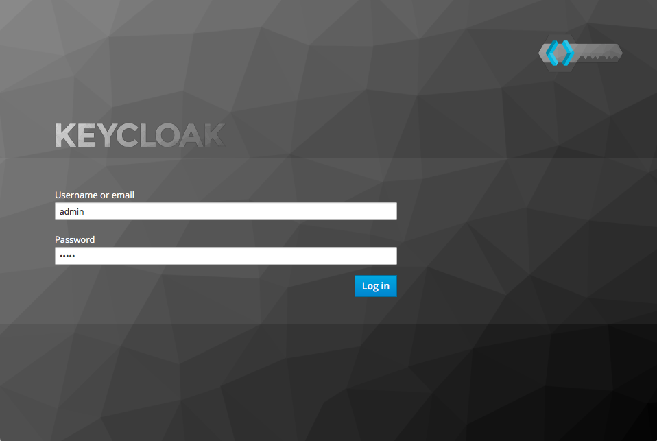
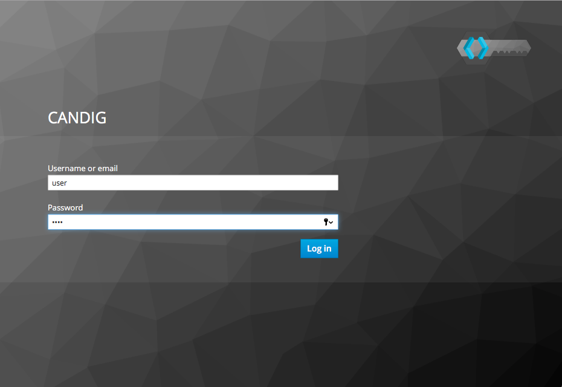

===========================
Token Tracer Walkthrough
===========================

1.0 Choosing the Deployment Environment 
-------------------------------------------

The token tracer may be deployed onto any system where the program may access the same network interface as the Keycloak server. Thus there are two options:

1. If the Keycloak server is deployed locally, then the token tracer must also be deployed on that local host machine within the same local host operating system.
2. If the Keycloak server is deployed on a virtual machine in a software container, then the token tracer should be deployed on the same software container.

This is to minimize difficulties in capturing packets across multiple nested network interfaces.

The token tracer is useful as both a network debugging and logging tool for applications secured via Keycloak. The token tracer only examines the authentication process for Keycloak and not authorization. 

The token tracer cannot decrypt HTTPS traffic using TLS/SSL. The Keycloak and secured application servers must be configured to use only the unecrypyed HTTP procotol.

Supports Keycloak 3.3.0.CR3

1.0.1 File Directory Layout
================================

For a deployment that uses git, on the same operating system that runs Keycloak, the Token Tracer directory should exist.

Here is an example that holds both Keycloak and the Token Tracer within the same directory /srv:

.. code-block:: text

    /srv/ 
    ├── keycloak/
    │   ├── keycloak directory contents
    │   └── ...
    └── tokenTracer/
	├── tokenTracer - Source code Directory
	├── docs        - Documentation
	├── tests       - Unit Tests
	├── README.rst  - README file
	├── INSTALL.rst - Installation instructions
	└── LICENSE.txt - Software License

    
1.1  Installation
---------------------

There are two options to install the token tracer:

1. Pip Installation
2. Git Installation

Pip is preferred for production deployments. Git installation is useful for development.

1.1.1 Pip Installation
=========================

SCREENSHOTS

Ensure that you have python and pip installed. 

``sudo pip install tokenTracer``

1.1.2 Git Installation
=========================

1. Install python, git, pip, pyshark, tshark

On debian:

``$ apt-get install -y git python python-pip tshark``

``$ pip install tshark``

2. Clone the git repository

``git clone https://github.com/Bio-Core/tokenTracer``

3. Run the program:

The program can be invoked using python:

``$ python ./tokenTracer.py``

The program may also be invoked directly:

``$ ./tokenTracer.py``

Command line arguments are appended to the invocation:

``$ ./tokenTracer.py -a``

1.2 Starting the token tracer
----------------------------------

Start the token tracer with:

``$ tokenTracer``

The token tracer will begin to sniff packets on the default interface eth0

1.2.1 Choosing a Network Interface
===================================

For live packet capture, the token tracer program must know which network interface to sniff packets on. This interface should be the same one on which the Keycloak server listens. 
The token tracer by default will listen on eth0, the first ethernet interface.

To determine the list of available network interfaces on your system, use a networking tool such as ip or ifconfig:

Use the command ip addr to display a list of available network interfaces:

::

    $ ip addr
    
    lo0: flags=8049<UP,LOOPBACK,RUNNING,MULTICAST> mtu 16384
        inet 127.0.0.1/8 lo0
        inet6 ::1/128
        inet6 fe80::1/64 scopeid 0x1
    en0: flags=8863<UP,BROADCAST,SMART,RUNNING,SIMPLEX,MULTICAST> mtu 1500
        ether 10:10:ff:11:11:aa
        inet6 ed10::1a1:ff9:999a:1a00/64 secured scopeid 0x4
        inet 142.1.11.101/11 brd 142.1.11.255 en0
    vboxnet0: flags=8943<UP,BROADCAST,RUNNING,PROMISC,SIMPLEX,MULTICAST> mtu 1500
        ether 0a:00:00:00:00:00
        inet 192.168.11.1/11 brd 192.168.99.255 vboxnet0

From these interfaces, you may select which to use for the token tracer. Here we have the following:

1. Loopback (localhost): lo0
2. Ethernet: en0
3. VirtualBox Network Interface: vboxnet0

The token tracer may be assigned to a network interface using the --interface option (short form -i) when starting the token tracer:

``$ tokenTracer -i en0``

For example, we may assign the token tracer to listen on the local loopback interface on localhost if keycloak is communicating locally:

``$ tokenTracer -i lo``

We may also assign the vboxnet0 interface if the Keycloak server is being hosted on a guest operating system using VirtualBox:

``$ tokenTracer -i vboxnet0``

1.2.2 Command Line Arguments
================================

Command-line arguments are appended to the invocation:

``$ tokenTracer -a -i eth0 --no-print``

The command line arguments are listed below:

--interface      The network interface on which to sniff
--all            Print all HTTP packets intercepted
--no-print       Do not print to stdout
--output-file    The output file to write to 
--input-file     The input packet capture file to read from

The --interface and --input-file commands are mutually exclusive, as the program may only either obtain packets either from an input file or from a live interface, but not both. 

1.4 Usage
--------------------------------

1.5 Printing from a packet capture (pcap) File
---------------------------------------------------

The token tracer may either capture on a live interface or from a packet capture file

Packet capture (pcap) files can be obtained from packet sniffer programs such as Wireshark or tcpdump when sniffing on live interfaces.

Use the --input-file command to read from a packet capture file in place of sniffing on a live interface:

``$ tokenTracer -if test/testfile.cap``

The tokenTracer displays the following output:

1.6 Using the Token Tracer in a generic setup
------------------------------------------------

The first two steps cover the manual installation and setup of the Keycloak server and the application server on which you wish to secure authentication. The installation procedure for these can be referenced in their original documentation.

1.6.1 Keycloak Installation
===============================

Install the Keycloak server as listed in its documentation:

Download the Keycloak runtime executables from the appropriate official mirrors.

Add an administrator account.

Execute the ``standaloneStart.sh`` shell script.

#. Log into keycloak.

#. Create a new realm.

#. Add a client for the application server.

#. Add a user to the realm.

#. Set the user's password. 

#. Keycloak will listen to port 8080 by default.

1.6.2 Application Server Installation
=========================================

Install the application server that you wish to use. Ensure that it does not listen on the same port as Keycloak. 

Ensure that the application server contains a Keycloak adapter or an oidc library that is properly integrated into the server's source code.

Edit the client_secrets.json file with the information from the Keycloak server. 
  
Start the application server.

1.7 Usage with the CanDIG project
-----------------------------------

An example use case for the token tracer is with the CanDIG project. The token tracer has been integrated into the deployment scheme so that the program can be set up automatically alongside Keycloak and the GA4GH server (our application server in this case). 

For the deployer script to work, you will need Docker.

The CanDIG project includes the GA4GH server as part of its application infrastructure. This server provides a REST API from which we can inquire about metadata for the genomic data stored on the server. This server is secured with Authentication through a Keycloak server. The token tracer can be used to intercept packets in unencrypted traffic.

Clone the git repository containing the deployer program:

``git clone https://github.com/Bio-Core/candigDeploy``

Change into the directory:

``cd candigDeploy``

Decide which interface to listen to. 

Start the deployer with the token tracer option enabled:

``./deployer.py -t -i 127.0.0.1``

The deployer script by default listens on localhost (127.0.0.1), so the -i option is not necessary, but we have put it here so that you change change the ip address to the desired one. The interface must be one of the valid network interfaces listed on your computer. You can determine the viable network interfaces using a program such as ip or ifconfig.

Once the deployment finishes, you should be able to access the keycloak server at:

``http://127.0.0.1:8080/auth``

Or at whatever IP address you set for the deployer.

The GA4GH server is accessible at:

``http://127.0.0.1:8000``

First, log into the GA4GH as follows:

1. Through a web browser, go to http://127.0.0.1:8000

Log in as the default user.

:Username: user
:Password: user

Once the login procedure completes, you should be redirected to the index webpage that lists both the REST API commands and datasets available:

You may also log in with curl:

``curl -L``

The token tracer should be catch the login:

Here we can see that an authorization code POST request was made to the token endpoint of the Keycloak server. The Keycloak server responded with with packet that contains the access token, refresh token, and id token for the client to use, including their expiry times. 

Now log into Keycloak as an administrator using the username and password below. Go to the URL of the adminsitration console through a web browser:

:Username: admin
:Password: admin
    
``http://127.0.0.1:8080/auth``

Now under the CanDIG realm, click on the token heading. Set the access token expiry to 1 minute. 

Go back to the GA4GH server. You will have to delete your browser cookies in order to reset your tokens. Log back into the server and wait 1 minute. Refresh the page after the 1 minute period.

The token tracer should have intercepted another request to the token endpoint that is using the refresh token. Again, another set of access, refresh, and id tokens should have been provided. 

You can see all the packet activity using the ALL option.

Shell into the docker container containing the keycloak server.

Run the token tracer program using the ALL option:

Now you will receive all the HTTP packets transmitted to and from the Keycloak server as output.

1.8 Using the token tracer in programs
------------------------------------------

We can use the token tracer as an input source to another program to process the resultant data, through one of several ways:

1. Import the program as a python module
2. Invoke the program as a separate process 

We can invoke the program separately in a shell script using the & command at end of the invocation in order to send the process to the background.

We can then pipe the output to another program:

``tokenTracer | program.py``

The output can also be simply redirected as an alterative:

``tokenTracer > program.py``

This can also be used as an alternative to create a file:

``tokenTracer > capture.txt``

Or using the json format:

``tokenTracer -j > capture.json``
